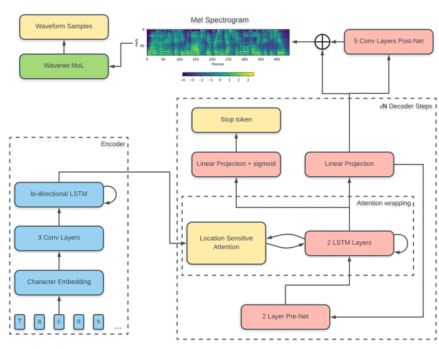
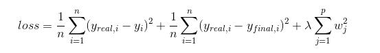

# Tacotron 2（without Wavenet）

Tacotron2 的tensorflow简化版本，具体可在此篇论文中查看[Natural TTS synthesis by conditioning Wavenet on MEL spectogram predictions](https://arxiv.org/pdf/1712.05884.pdf)
在本例中没有使用wavenet vocoder，仅使用tacotron2模型从文本生成mel频谱，使用griffin lim将mel频谱转换为wav波形。

## 模型结构

模型输入为文本序列，输出为解码器（Post-Net前）的输出（Mel频谱）以及Post-Net后的输出（残差）之和

## 损失函数

损失函数分为三部分，Post-Net前MSE和Post-Net后MSE以及L2正则化项

## 进入工程目录

> cd tacotron2

## 安装

> pip install -r requirements.txt

## 下载数据集

下载[ljspeech dataset](https://keithito.com/LJ-Speech-Dataset/)，并解压，解压完成后工程目录下会创建LJSpeech-1.1目录

> wget https://data.keithito.com/data/speech/LJSpeech-1.1.tar.bz2

## 数据预处理

执行预处理脚本

> python preprocess.py

会在tacotron2目录下生成training_data文件夹保存已与处理好的数据

## 训练模型

> python train.py

训练的模型保存在tacotron_log/taco_pretrained目录下

## 生成音频

> python eval.py

生成的结果保存在taco_output/wav目录下，可使用音频播放软件播放试听效果

## 相关资源:
- [Tacotron2论文](https://arxiv.org/pdf/1712.05884.pdf)
- [原始Tacotron论文](https://arxiv.org/pdf/1703.10135.pdf)
- [tacotron2代码参考](https://github.com/Rayhane-mamah/Tacotron-2)

