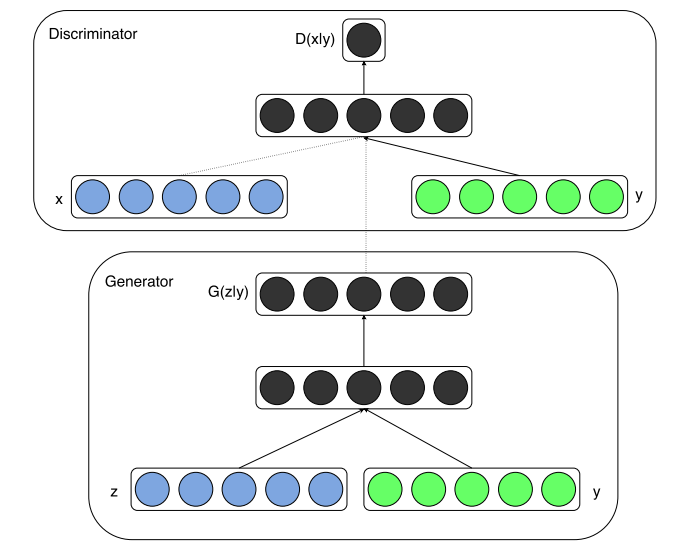
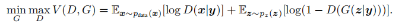
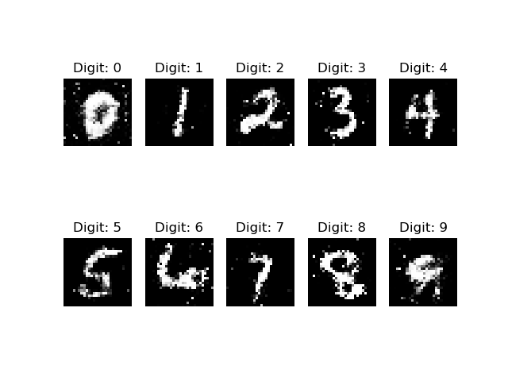

# Conditional Generative Adversarial Networks
此项目是基于Tensorflow、keras的[Conditional Generative Adversarial Networks](https://arxiv.org/abs/1411.1784)实现。

## 网络架构


## 损失函数 


## 数据集
mnist

## 训练
```
python cgan.py
```

## 生成结果
### GPU: 1080TI
### batch_size = 32    
### epochs = 20000
### 训练时长：15min

