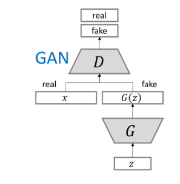
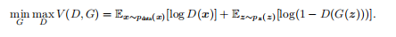
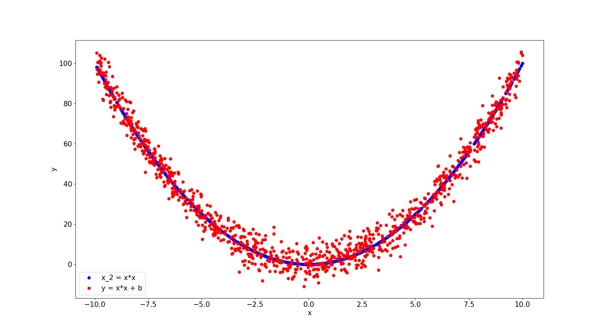

# Generative Adversarial Nets
此项目思想来源于[Generative Adversarial Nets](https://arxiv.org/abs/1406.2661)，是以GAN的思路拟合y=x^2 + b 的一个tensorflow、keras实现。

## 网络架构


## 损失函数 


## 训练
```
python gan.py
```


## 数据查看

