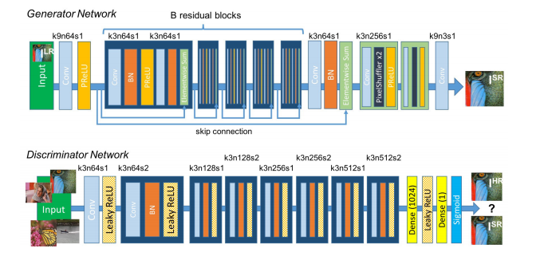
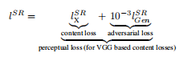
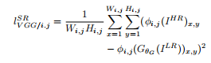
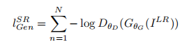
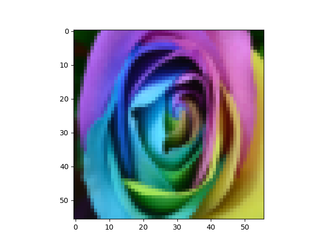
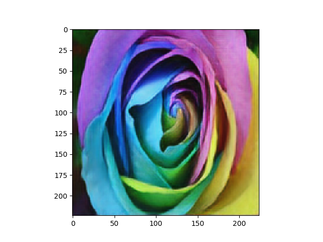
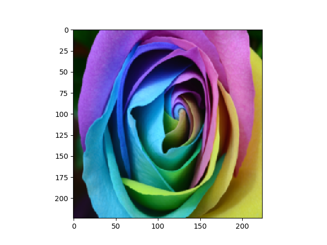

# Photo-Realistic Single Image Super-Resolution Using a Generative Adversarial Network
此项目是基于Tensorflow、keras的[Photo-Realistic Single Image Super-Resolution Using a Generative Adversarial](https://arxiv.org/abs/1609.04802)实现。

## 网络架构


## 损失函数 

### 损失分为内容损失与对抗损失


### 内容损失


### 对抗损失


## 数据集
https://data.vision.ee.ethz.ch/cvl/DIV2K/

## 训练
```
python srgan.py
```

## 生成结果
### GPU: 1080TI
### batch_size = 8     
### epochs = 1000
### 耗时：5h

#### 低分辨率


#### 生成高辨率


#### 原始高分辨率
